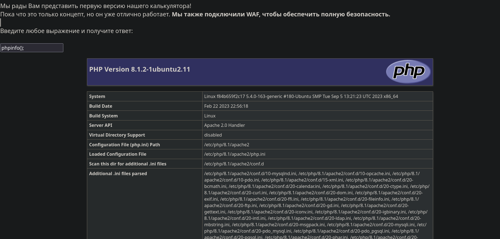
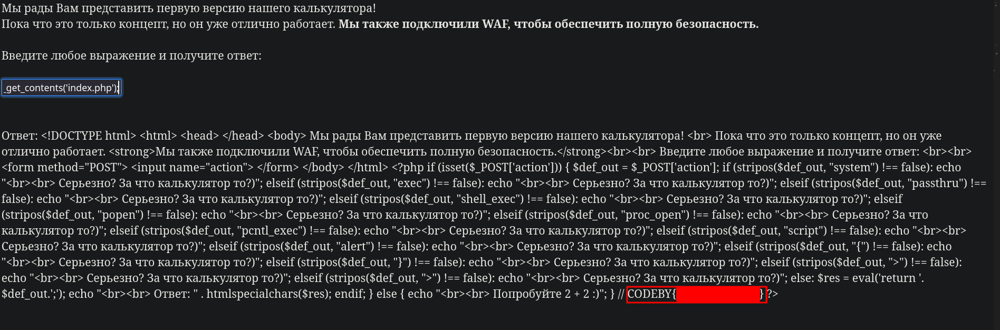

# [Калькулятор (WEB)](https://codeby.games/categories/web/364d97d3-ffb4-4ae1-9602-0210fb065a60)

**level**: **Easy**

**Description**: Флаг лежит внутри, попробуйте найти его

**Hint:** Если ты сейчас пытаешься обойти фильтры, то ты на правильном пути :D

## Решение

Для данной тачки существует уязвимость Command Injection.
Command Injection (Внедрение команд) - это тип атаки на безопасность, когда злоумышленник вводит вредоносные команды через уязвимое веб-приложение. Целью такой атаки является выполнение вредоносных команд на сервере или получение несанкционированного доступа к системе.
Для проверки попробуем ввести функцию `phpinfo()`.

Далее немного погуглив узнаём небезопастные функции [habr](https://habr.com/ru/companies/modesco/articles/472092/)
Попробуем ввести функции исполнения команд:

```
exec
expect_popen
passthru
system
shell_exec
popen
proc_open
pcntl_exec
```

Все эти команды нам не подходят, их фильтруют и неполучиться их выполнить. В hint-e от Codeby намекают на обход фильтра. Попробуем найти другие доступные функции.

`getcwd();`

Узнаём, что мы находимся в каталоге `/var/www/html/`. В самом такске сказано что флаг находиться внутри кода, значит нужно вывести файл.
Попробуем запустить такую функцию.
`file_get_contents('index.php');`



В итоге видим весь исходный код и наш флаг :D
